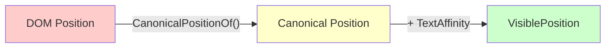
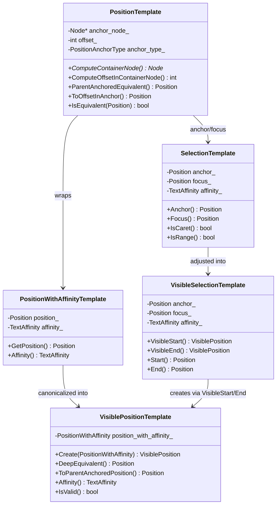

[Home](README.md) | Next: [Chapter 2: How VisiblePosition Is Computed →](02_how_visible_position_is_computed.md)

---

# Chapter 1: VisiblePosition — Overview & How It Differs from DOM Position

## 1.1 What Is a DOM Position?

A **DOM Position** (`Position` / `PositionTemplate<Strategy>`) is a raw location in the DOM tree. It is defined by:

| Field | Description |
|-------|-------------|
| `anchor_node_` | The DOM `Node` this position is anchored to |
| `offset_` | An integer offset (meaningful for `kOffsetInAnchor` type) |
| `anchor_type_` | One of `kOffsetInAnchor`, `kBeforeAnchor`, `kAfterAnchor`, `kAfterChildren` |

A DOM position is purely structural — it does not consider layout, rendering, visibility, or editing rules. Multiple DOM positions can be **visually equivalent**: they appear at the same rendered location but are represented differently in the DOM.

### Example: Multiple DOM Positions at the Same Visual Location

```html
<p>Hello <b>World</b></p>
```

The following DOM positions are all visually equivalent (they all appear between "Hello " and "World"):

| Position | Description |
|----------|------------|
| `(p, 1)` | Offset 1 in `<p>` (after the text node "Hello ") |
| `("Hello ", 6)` | After the last character in text node "Hello " |
| `(b, kBeforeAnchor)` | Before the `<b>` element |
| `("World", 0)` | Before the first character in text node "World" |
| `(b, 0)` | Offset 0 in `<b>` |

## 1.2 What Is a VisiblePosition?

A **VisiblePosition** (`VisiblePositionTemplate<Strategy>`) is an immutable object representing a **"canonical position"** with **affinity**. It answers: **"Where would the caret actually be rendered?"**

| Field | Description |
|-------|-------------|
| `position_with_affinity_` | A `PositionWithAffinityTemplate<Strategy>` wrapping the canonical `Position` + `TextAffinity` |
| `dom_tree_version_` | (DCHECK only) Tracks DOM version at creation for validity checking |
| `style_version_` | (DCHECK only) Tracks style version at creation for validity checking |

### Key Properties

1. **Canonical**: Among all visually equivalent DOM positions, VisiblePosition picks exactly one — the **canonical position** (computed via `CanonicalPositionOf()`)
2. **Immutable**: Once created, a VisiblePosition never changes
3. **Layout-dependent**: Requires a clean layout tree (no pending style/layout updates)
4. **Affinity-aware**: Handles line wrapping ambiguity via `TextAffinity`

## 1.3 TextAffinity — Resolving Line Wrap Ambiguity

When text wraps, a single position can appear at two visual locations:

```
abc|     ← UPSTREAM affinity (end of this line)
|def     ← DOWNSTREAM affinity (start of next line)
```

| Affinity | Meaning |
|----------|---------|
| `TextAffinity::kDownstream` | Caret is at the **start** of the next line (default) |
| `TextAffinity::kUpstream` | Caret is at the **end** of the current line |

**Rule**: UPSTREAM affinity is only used when the position is at the end of a wrapped line. Otherwise, it is converted to DOWNSTREAM.

## 1.4 Key Differences Summary



| Aspect | DOM Position | VisiblePosition |
|--------|-------------|-----------------|
| **Representation** | Multiple positions can map to the same visual point | Exactly one canonical position per visual point |
| **Layout dependency** | No layout needed | Requires clean layout tree |
| **Affinity** | None | UPSTREAM or DOWNSTREAM |
| **Immutability** | Mutable (can be reassigned) | Immutable after creation |
| **Validity** | Valid as long as node exists | Valid only if DOM and style haven't changed since creation |
| **Handles invisible nodes** | Yes (can point into hidden nodes) | No (skips invisible/non-rendered content) |
| **Tables/Non-editable** | Raw position, no special handling | Adjusts position around tables and non-editable elements |

## 1.5 The Two Tree Strategies

All position and selection types are templated on a **Strategy**:

| Strategy | Tree | Type Alias |
|----------|------|-----------|
| `EditingStrategy` | DOM tree | `Position`, `VisiblePosition`, `SelectionInDOMTree` |
| `EditingInFlatTreeStrategy` | Flat tree (shadow DOM resolved) | `PositionInFlatTree`, `VisiblePositionInFlatTree`, `SelectionInFlatTree` |

The flat tree "flattens" shadow DOM boundaries, resolving slot assignments and shadow host relationships. Many editing operations work on the flat tree to get the correct visual result.

## 1.6 Key Terminology Glossary

### `DeepEquivalent`

The **canonical position** stored inside a `VisiblePosition`. Accessed via `VisiblePosition::DeepEquivalent()`. This is the `Position` that was computed by `CanonicalPositionOf()` and stored in the VisiblePosition.

```cpp
PositionTemplate<Strategy> DeepEquivalent() const {
  return position_with_affinity_.GetPosition();
}
```

### `ParentAnchoredEquivalent`

Converts a position to a **parent-anchored** form suitable for use with DOM `Range` objects. Neighbor-anchored positions (`kBeforeAnchor`, `kAfterAnchor`) are invalid for `Range`, so they must be converted.

**Special handling**:
- For nodes where `EditingIgnoresContent()` returns true or `IsDisplayInsideTable()` returns true:
  - offset == 0 → `InParentBeforeNode(*anchor_node_)`
  - at end → `InParentAfterNode(*anchor_node_)`
- Otherwise converts to `(ContainerNode, OffsetInContainerNode)` form

```
FIXME: This should only be necessary for legacy positions, but is also
needed for positions before and after Tables
```

### `IsVisuallyEquivalentCandidate`

A position is a "visually equivalent candidate" if it represents a valid caret position that a user could place a cursor at. Checks include:
- Node must have a LayoutObject
- Must be visible (`visibility: visible`)
- Not paint-locked by display lock
- For `<br>`: must be before the `<br>`, not after
- For text: must be in rendered (non-collapsed) text
- For SVG: only SVG inline text is a candidate
- For tables/editing-ignores-content nodes: must be at first or last editing position
- For block-level elements: depends on editability and boundary conditions

### `RootEditableElement`

The highest ancestor `Element` that is editable, stopping at `<body>`. Found by walking up ancestors while they are editable:

```cpp
Element* RootEditableElement(const Node& node) {
  // Walks ancestors, tracking last editable Element, stops at <body>
}
```

### `HighestEditableRoot`

Similar to `RootEditableElement` but returns a `ContainerNode*` and goes even higher — if the root editable element is `<body>` it returns `<body>`; if `designMode='on'` it may return the `Document`. It searches "in defiance of editing boundaries."

## 1.7 Relationship Diagram



## 1.8 Bug References

| Bug | Context |
|-----|---------|
| [crbug.com/648949](https://crbug.com/648949) | Clients store VisiblePosition and inspect after mutation — should be fixed |
| [crbug.com/735327](https://crbug.com/735327) | `anchor_node_` should be `Member<const Node>` to enforce constness |
| [crbug.com/761173](https://crbug.com/761173) | `IsConnected()` for PositionInFlatTree should be renamed to `ComputeIsConnected()` |
| [crbug.com/889737](https://crbug.com/889737) | Before/After anchor should have parent node for converting to offset |
| [wkb.ug/63040](http://wkb.ug/63040) | Constructor taking `(Node*, int)` should eventually go away |
