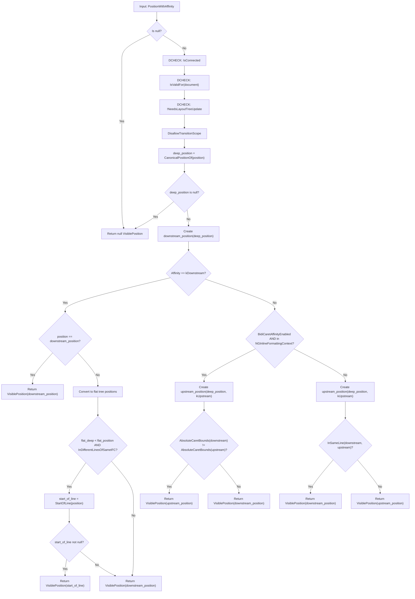
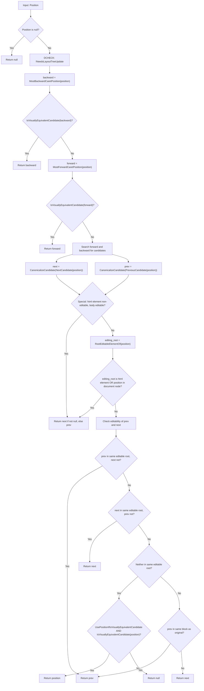
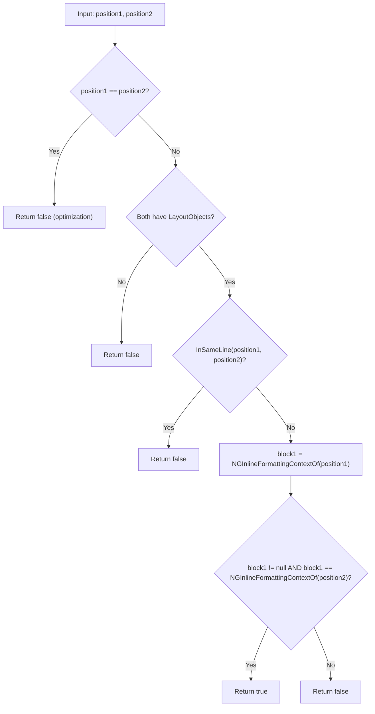
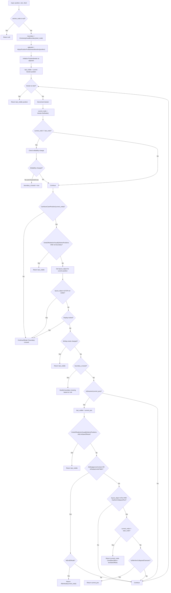
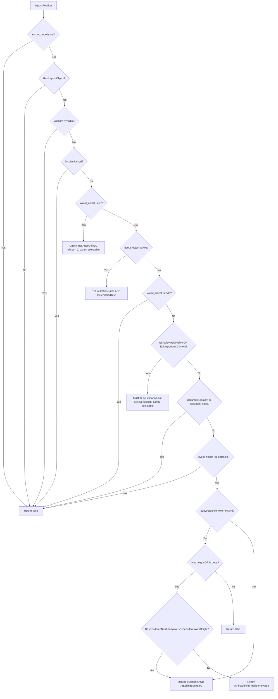

[← Chapter 1: Overview](01_overview_visible_position_vs_dom_position.md) | [Home](README.md) | [Chapter 3: Position & PositionTemplate Classes →](03_position_and_position_template_classes.md)

---

# Chapter 2: How VisiblePosition Is Computed — The Complete Flow

## 2.1 Entry Points

There are four main entry points for creating a `VisiblePosition`:

```cpp
// From Position + optional affinity
VisiblePosition CreateVisiblePosition(const Position&, TextAffinity = kDefault);

// From PositionWithAffinity
VisiblePosition CreateVisiblePosition(const PositionWithAffinity&);

// Flat tree variants
VisiblePositionInFlatTree CreateVisiblePosition(const PositionInFlatTree&, TextAffinity = kDefault);
VisiblePositionInFlatTree CreateVisiblePosition(const PositionInFlatTreeWithAffinity&);
```

All of these delegate to `VisiblePositionTemplate<Strategy>::Create()`.

## 2.2 The Main Flow: `VisiblePositionTemplate::Create()`



### Step-by-Step Explanation

#### Step 1: Null & Validity Checks
The input `PositionWithAffinity` is checked for null. The position must be connected to the document, valid, and the layout tree must be clean.

#### Step 2: Canonicalization
The most critical step — `CanonicalPositionOf()` computes the canonical position (see [Section 2.3](#23-canonicalpositionof---the-core-algorithm) for full details).

#### Step 3: Affinity Resolution (DOWNSTREAM case)
When the requested affinity is `kDownstream`:
- **Fast path**: If the original position equals the canonical downstream position, return immediately
- **Line crossing check**: If the canonical position went into a *previous* line of the same inline formatting context, use `StartOfLine()` instead. This prevents the cursor from jumping to the end of the previous line when it should stay at the start of the current line
- Otherwise, use the canonical downstream position

#### Step 4: Affinity Resolution (UPSTREAM case)
When the requested affinity is `kUpstream`:

**With `BidiCaretAffinityEnabled` + NG inline context:**
- Create both upstream and downstream PositionWithAffinity objects
- Compare their `AbsoluteCaretBounds` — if they render at different locations, this is a true line wrap or bidi boundary → use UPSTREAM
- If they render at the same location → use DOWNSTREAM (no wrap here)

**Legacy path (no bidi affinity feature or no NG context):**
- Check if downstream and upstream positions are `InSameLine`
- If same line → use DOWNSTREAM (no wrap ambiguity)
- If different lines → use UPSTREAM (this is a genuine wrap point)

## 2.3 `CanonicalPositionOf()` — The Core Algorithm



### Key Design Decisions in CanonicalPositionOf

1. **Leftmost bias**: The canonical position favors the **leftmost** (most backward) visually equivalent candidate
   ```
   FIXME (9535): Canonicalizing to the leftmost candidate means that if
   we're at a line wrap, we will ask layoutObjects to paint downstream
   carets for other layoutObjects.
   ```

2. **Editable root preservation**: The canonical position must stay within the same editable root as the original position

3. **Same block preference**: When both prev and next candidates are in the same editable root, the algorithm prefers the one in the same block flow element

4. **Bug reference**: [crbug.com/472258](https://crbug.com/472258) — "Sometimes updating selection positions can be extremely expensive and occur frequently. Often calling preventDefault on mousedown events can avoid doing unnecessary text selection work."

5. **Bug reference**: [issues.chromium.org/40890187](https://issues.chromium.org/40890187) — When prev/next editing root is not in the same block as editing_root, but the position is editable and a visually equivalent candidate, directly return the position.

## 2.4 `CanonicalizeCandidate()` — Helper

```cpp
template <typename PositionType>
static PositionType CanonicalizeCandidate(const PositionType& candidate) {
  if (candidate.IsNull())
    return PositionType();
  DCHECK(IsVisuallyEquivalentCandidate(candidate));
  PositionType upstream = MostBackwardCaretPosition(candidate);
  if (IsVisuallyEquivalentCandidate(upstream))
    return upstream;
  return candidate;
}
```

Takes a candidate position and tries to move it backward (upstream). If the backward position is also a valid candidate, use it (leftmost bias). Otherwise, keep the original candidate.

## 2.5 `InDifferentLinesOfSameInlineFormattingContext()` — Helper



Returns `true` when two positions are on *different lines* but within the *same* inline formatting context (same `LayoutBlockFlow`). Used to detect when canonicalization jumped to a previous line within the same paragraph.

## 2.6 `MostBackwardCaretPosition()` — Detailed Flow

This function finds the visually equivalent position that is most backward (upstream) in document order.



### Key Behaviors

- **Visual boundary**: Iterates within the enclosing visual boundary (`EnclosingVisualBoundary`), stops at nodes where `EndsOfNodeAreVisuallyDistinctPositions` returns true
- **Editability**: Respects `EditingBoundaryCrossingRule` — won't cross editing boundaries if `kCannotCrossEditingBoundary`
- **Invisible nodes**: Skips nodes with no layout object, `visibility:hidden`, or display-locked ancestors
- **Tables**: Returns `AfterNode` for table elements (never enters them)
- **EditingIgnoresContent**: Returns `AfterNode` for nodes whose content is ignored
- **Writing mode changes**: Stops when writing mode differs
- **SVG**: `CanHaveCaretPosition` returns false for non-text SVG elements (except `<text>` and `<foreignObject>`)

## 2.7 `MostForwardCaretPosition()` — Mirror of Backward

Similar to `MostBackwardCaretPosition` but iterates **forward**. Key differences:
- Returns `BeforeNode` for tables/ignored content
- Returns `(current_node, CaretMinOffset + textStartOffset)` for first text in a new node
- Stops before going above `<body>` into `<head>`

## 2.8 `IsVisuallyEquivalentCandidate()` — The Gatekeeper



### Special Cases in IsVisuallyEquivalentCandidate

| Element Type | Rule |
|-------------|------|
| `<br>` | Only before the BR is a candidate, not after; parent must be selectable |
| Text nodes | Must be selectable, must be in rendered (non-collapsed) text |
| SVG elements | Never candidates (except SVG inline text checked via `IsText()`) |
| Tables | Only at first/last editing position, parent must be selectable |
| `EditingIgnoresContent` nodes | Same as tables |
| `<html>` / Document | Never candidates |
| Block-level elements | Empty blocks → first editing position only; blocks with content → only at editing boundaries if editable |

## 2.9 Complete End-to-End Sequence Diagram

```mermaid
sequenceDiagram
    participant Caller
    participant CreateVisiblePosition
    participant "VisiblePosition::Create"
    participant CanonicalPositionOf
    participant MostBackwardCaretPosition
    participant MostForwardCaretPosition
    participant IsVisuallyEquivalentCandidate
    participant InSameLine
    participant AbsoluteCaretBoundsOf
    
    Caller->>CreateVisiblePosition: Position + Affinity
    CreateVisiblePosition->>"VisiblePosition::Create": PositionWithAffinity
    
    Note over "VisiblePosition::Create": Null/validity checks
    
    "VisiblePosition::Create"->>CanonicalPositionOf: raw position
    CanonicalPositionOf->>MostBackwardCaretPosition: position
    MostBackwardCaretPosition-->>CanonicalPositionOf: backward candidate
    CanonicalPositionOf->>IsVisuallyEquivalentCandidate: backward candidate
    
    alt backward is valid candidate
        IsVisuallyEquivalentCandidate-->>CanonicalPositionOf: true
        CanonicalPositionOf-->>"VisiblePosition::Create": canonical position
    else backward not valid
        CanonicalPositionOf->>MostForwardCaretPosition: position
        MostForwardCaretPosition-->>CanonicalPositionOf: forward candidate
        CanonicalPositionOf->>IsVisuallyEquivalentCandidate: forward candidate
        
        alt forward is valid candidate
            CanonicalPositionOf-->>"VisiblePosition::Create": canonical position
        else neither valid - search wider
            Note over CanonicalPositionOf: NextCandidate + PreviousCandidate
            CanonicalPositionOf-->>"VisiblePosition::Create": best candidate
        end
    end
    
    alt Affinity is DOWNSTREAM
        Note over "VisiblePosition::Create": Fast path or line-crossing check
    else Affinity is UPSTREAM
        "VisiblePosition::Create"->>InSameLine: downstream vs upstream
        alt Same line
            Note over "VisiblePosition::Create": Use DOWNSTREAM
        else Different line
            Note over "VisiblePosition::Create": Keep UPSTREAM
        end
    end
    
    "VisiblePosition::Create"-->>CreateVisiblePosition: VisiblePosition
    CreateVisiblePosition-->>Caller: VisiblePosition
```

## 2.10 FIXMEs and TODOs in Creation Flow

| Location | Comment |
|----------|---------|
| `CanonicalPosition()` | `FIXME (9535)`: Canonicalizing to the leftmost candidate means painting downstream carets for other layoutObjects at line wraps |
| `VisiblePosition.h` | `TODO(yosin)`: `operator==` deleted — will have `equals()` when needed |
| `VisiblePosition.h` | `TODO(editing-dev)`: Should have `DCHECK(isValid())` in accessor functions but some clients violate this. See [crbug.com/648949](https://crbug.com/648949) |
| `MostBackwardCaretPosition()` | `FIXME`: PositionIterator should respect Before and After positions |
| `MostBackwardCaretPosition()` | `TODO(yosin)`: Should make MostBack/ForwardCaretPosition work for positions other than kOffsetInAnchor |
| `CanonicalPosition()` | `TRACE_EVENT` for performance: [crbug.com/472258](https://crbug.com/472258) |
