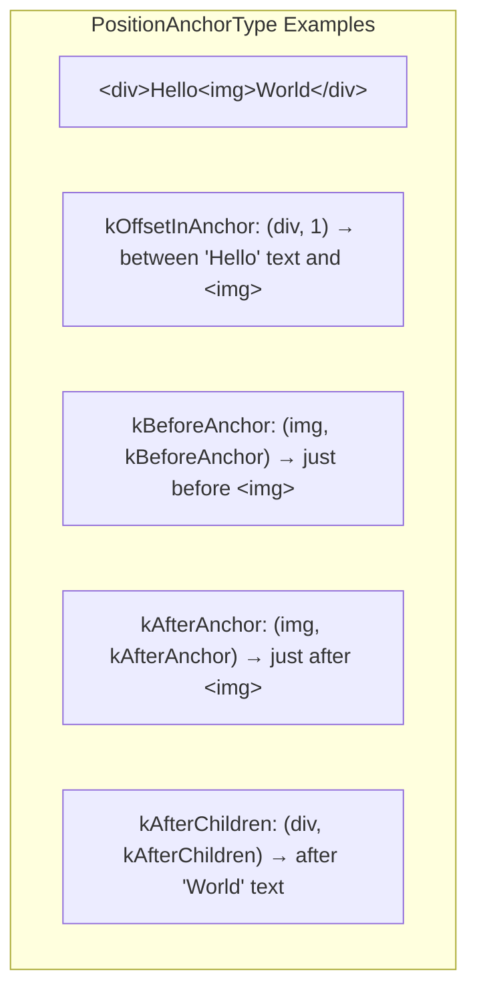
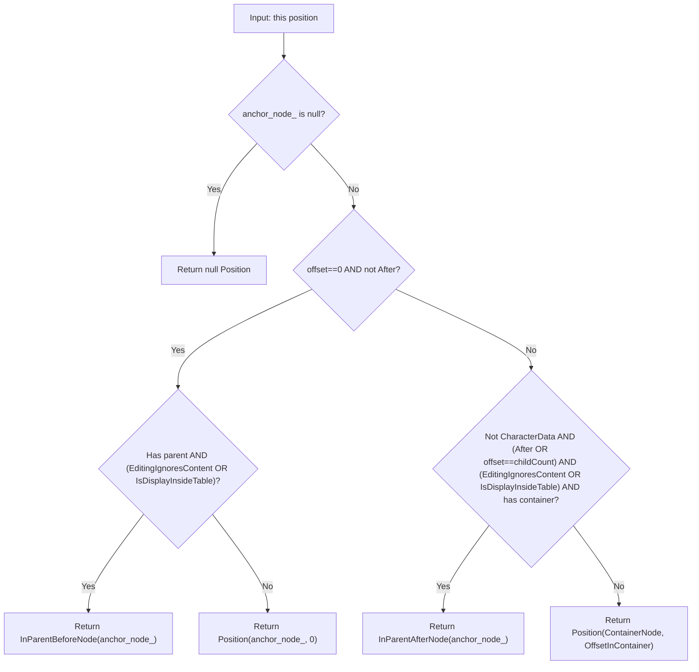

[← Chapter 2: How VisiblePosition Is Computed](02_how_visible_position_is_computed.md) | [Home](README.md) | [Chapter 4: Selection & SelectionTemplate Classes →](04_selection_and_selection_template_classes.md)

---

# Chapter 3: Position and PositionTemplate Classes

**Source files:**
- `third_party/blink/renderer/core/editing/position.h`
- `third_party/blink/renderer/core/editing/position.cc`
- `third_party/blink/renderer/core/editing/position_with_affinity.h`
- `third_party/blink/renderer/core/editing/position_with_affinity.cc`

## 3.1 PositionTemplate\<Strategy\>

An immutable object representing a location in the DOM tree (or flat tree, depending on Strategy).

### 3.1.1 Internal Storage

```cpp
Member<Node> anchor_node_;           // The DOM node this position is anchored to
int offset_ = 0;                     // Offset within the anchor node
PositionAnchorType anchor_type_ = PositionAnchorType::kOffsetInAnchor;
```

### 3.1.2 PositionAnchorType Enum

| Value | Description |
|-------|-------------|
| `kOffsetInAnchor` | Position is at `offset_` within `anchor_node_` (like a DOM Range boundary point) |
| `kBeforeAnchor` | Position is immediately before `anchor_node_` (neighbor-anchored) |
| `kAfterAnchor` | Position is immediately after `anchor_node_` (neighbor-anchored) |
| `kAfterChildren` | Position is after all children of `anchor_node_` |



### 3.1.3 Constructors

| Constructor | Description |
|------------|-------------|
| `PositionTemplate()` | Default — null position |
| `PositionTemplate(const Node*, PositionAnchorType)` | Neighbor-anchored (Before/After/AfterChildren). Node must not be null |
| `PositionTemplate(const Node&, int)` | Offset-in-anchor. Validates offset against node children/data length |
| `PositionTemplate(const Node*, int)` | Same but allows nullptr (creates null position). **TODO**: [wkb.ug/63040](http://wkb.ug/63040) — should go away |

**DCHECK for Flat Tree Strategy**: Shadow roots cannot be anchor nodes in `EditingInFlatTreeStrategy`.

### 3.1.4 Static Factory Methods

| Method | Signature | Description |
|--------|-----------|-------------|
| `BeforeNode` | `static Position BeforeNode(const Node&)` | Position before the node (`kBeforeAnchor`) |
| `AfterNode` | `static Position AfterNode(const Node&)` | Position after the node (`kAfterAnchor`) |
| `InParentBeforeNode` | `static Position InParentBeforeNode(const Node&)` | Position in parent at node's index (`kOffsetInAnchor` in parent) |
| `InParentAfterNode` | `static Position InParentAfterNode(const Node&)` | Position in parent at node's index + 1 |
| `FirstPositionInNode` | `static Position FirstPositionInNode(const Node&)` | `(node, 0)` |
| `LastPositionInNode` | `static Position LastPositionInNode(const Node&)` | For text: `(node, length)`. For elements: `(node, kAfterChildren)` |
| `FirstPositionInOrBeforeNode` | `static Position FirstPositionInOrBeforeNode(const Node&)` | If `EditingIgnoresContent` → `BeforeNode`, else `FirstPositionInNode` |
| `LastPositionInOrAfterNode` | `static Position LastPositionInOrAfterNode(const Node&)` | If `EditingIgnoresContent` and has parent → `AfterNode`, else `LastPositionInNode` |
| `EditingPositionOf` | `static Position EditingPositionOf(const Node*, int)` | Smart constructor: for text nodes uses offset, for editing-ignored nodes uses Before/After anchor, otherwise creates offset position |
| `CreateWithoutValidation` | `static Position CreateWithoutValidation(const Node&, int)` | Creates offset position without validating offset. Used for undo/redo where offset may be temporarily out of bounds |

### 3.1.5 Key Instance Methods

| Method | Return | Description |
|--------|--------|-------------|
| `AnchorNode()` | `Node*` | The anchor node (can be null for null positions) |
| `AnchorType()` | `PositionAnchorType` | The anchor type |
| `IsNull()` / `IsNotNull()` | `bool` | Null check |
| `IsOrphan()` | `bool` | Non-null but disconnected from document |
| `IsConnected()` | `bool` | Node is connected to the document. **TODO** [crbug.com/761173](https://crbug.com/761173): rename to `ComputeIsConnected()` for flat tree (expensive) |
| `IsValidFor(Document&)` | `bool` | Valid for a specific document |
| `GetDocument()` | `Document*` | The document, or null |
| `ComputeContainerNode()` | `Node*` | The container node. For `kOffsetInAnchor`/`kAfterChildren` → anchor itself. For `kBeforeAnchor`/`kAfterAnchor` → parent. **TODO** [crbug.com/889737](https://crbug.com/889737) |
| `ComputeOffsetInContainerNode()` | `int` | Container offset. O(n) for neighbor-anchored, O(1) for offset-anchored |
| `OffsetInContainerNode()` | `int` | Inline O(1) — only valid for `kOffsetInAnchor` |
| `ComputeEditingOffset()` | `int` | offset_ for `kOffsetInAnchor`, 0 for `kBeforeAnchor`, last editing offset for `kAfterAnchor`/`kAfterChildren` |
| `ComputeNodeBeforePosition()` | `Node*` | The node immediately before this position |
| `ComputeNodeAfterPosition()` | `Node*` | The node immediately after this position |

### 3.1.6 Conversion Methods

| Method | Return | Description |
|--------|--------|-------------|
| `ParentAnchoredEquivalent()` | `Position` | Converts to a parent-anchored position suitable for Range. See [Chapter 1](01_overview_visible_position_vs_dom_position.md#parentanchoredequivalent) |
| `ToOffsetInAnchor()` | `Position` | Converts any anchor type to `kOffsetInAnchor` at `(ContainerNode, OffsetInContainerNode)` |
| `IsEquivalent(Position)` | `bool` | True if both represent the same location, regardless of anchor type. Compares via `ToOffsetInAnchor()` |

### 3.1.7 Comparison

| Method | Description |
|--------|-------------|
| `CompareTo(Position)` | Returns -1, 0, or 1 via `ComparePositions()` |
| `operator<` / `<=` / `>` / `>=` | Standard comparison operators |

### 3.1.8 Editing Position Detection

| Method | Return | Description |
|--------|--------|-------------|
| `AtFirstEditingPositionForNode()` | `bool` | True if at the beginning. **FIXME**: Before anchor shouldn't count but does for legacy reasons |
| `AtLastEditingPositionForNode()` | `bool` | True if at the end. **TODO(yosin)**: After anchor shouldn't count |
| `AtStartOfTree()` | `bool` | No parent and no node before |

### 3.1.9 Range Support Methods

| Method | Return | Description |
|--------|--------|-------------|
| `NodeAsRangeFirstNode()` | `Node*` | First node in a range starting here |
| `NodeAsRangeLastNode()` | `Node*` | Last node in a range ending here |
| `NodeAsRangePastLastNode()` | `Node*` | Past-the-end node for range |
| `CommonAncestorContainer(Position)` | `Node*` | Common ancestor of two positions' container nodes |

### 3.1.10 ParentAnchoredEquivalent — Deep Dive



**Note**:
```
FIXME: This should only be necessary for legacy positions, but is also
needed for positions before and after Tables
```

## 3.2 PositionWithAffinityTemplate\<Strategy\>

A simple wrapper pairing a `Position` with a `TextAffinity`.

### 3.2.1 Internal Storage

```cpp
PositionTemplate<Strategy> position_;
TextAffinity affinity_;
```

### 3.2.2 Constructors

| Constructor | Description |
|------------|-------------|
| `PositionWithAffinityTemplate(Position, TextAffinity)` | Full constructor |
| `PositionWithAffinityTemplate(Position)` | Defaults affinity to `kDownstream` |
| `PositionWithAffinityTemplate()` | Null constructor |

### 3.2.3 Key Methods

| Method | Return | Description |
|--------|--------|-------------|
| `GetPosition()` | `const Position&` | The wrapped position |
| `Affinity()` | `TextAffinity` | The affinity |
| `operator==` | `bool` | True if both null, or both position and affinity match |
| `IsNotNull()` / `IsNull()` | `bool` | Delegation to position |
| `IsOrphan()` / `IsConnected()` | `bool` | Delegation to position |
| `AnchorNode()` | `Node*` | Delegation to position |
| `GetDocument()` | `Document*` | Delegation to position |

### 3.2.4 Tree Conversion Functions

| Function | Signature |
|----------|-----------|
| `ToPositionInDOMTreeWithAffinity` | `PositionWithAffinity → PositionWithAffinity` (identity for DOM tree) |
| `ToPositionInDOMTreeWithAffinity` | `PositionInFlatTreeWithAffinity → PositionWithAffinity` |
| `ToPositionInFlatTreeWithAffinity` | `PositionWithAffinity → PositionInFlatTreeWithAffinity` |

## 3.3 Position Tree Conversion Functions

### `ToPositionInFlatTree(const Position&)` → `PositionInFlatTree`

Converts a DOM tree position to its flat tree equivalent. Handles:
- Text/character data nodes: direct mapping with same offset
- Offset positions at start (0): maps to `FirstPositionInNode` (adjusts for shadow hosts)
- Offset positions at end (no child): maps to `LastPositionInNode`
- Shadow root anchors: redirects to `OwnerShadowHost()`
- Before/After anchors: requires parent in flat tree (returns null if no flat tree parent)
- Children that are shadow roots: special handling

### `ToPositionInDOMTree(const PositionInFlatTree&)` → `Position`

Reverse conversion. For offset positions, maps through `FlatTreeTraversal::ChildAt()`.

## 3.4 Operator== for Position

```cpp
FIXME: In <div></div> [div, 0] != [img, 0] even though most of the
editing code will treat them as identical.
```

Only compares anchor node, anchor type, and (for `kOffsetInAnchor`) the offset. Different anchor types with the same logical position are **not** equal — use `IsEquivalent()` instead.

## 3.5 All Bug Links

| Bug | Context |
|-----|---------|
| [wkb.ug/63040](http://wkb.ug/63040) | `Position(Node*, int)` constructor should go away |
| [crbug.com/735327](https://crbug.com/735327) | `anchor_node_` should be `Member<const Node>` |
| [crbug.com/761173](https://crbug.com/761173) | `IsConnected()` should be renamed for flat tree |
| [crbug.com/889737](https://crbug.com/889737) | `ComputeContainerNode()` — Before/After should have parent |

## 3.6 All FIXMEs and TODOs

| Location | Text |
|----------|------|
| `operator==` | `FIXME`: `[div, 0] != [img, 0]` even though they're treated as identical |
| `AtFirstEditingPositionForNode` | `FIXME`: Position before anchor shouldn't be considered at first editing position |
| `AtLastEditingPositionForNode` | `TODO(yosin)`: Position after anchor shouldn't be considered at first editing position |
| `AtLastEditingPositionForNode` | `TODO(yosin)`: Should use `Strategy::lastOffsetForEditing()` instead of DOM tree version |
| `InParentBeforeNode` | `FIXME`: Should `DCHECK(node.parentNode())`. Caller hits this — `editing/deleting/delete-ligature-001.html` crashes |
| `ParentAnchoredEquivalent` | `FIXME`: Should only be necessary for legacy positions, also needed for Tables |
| Constructors | `TODO(editing-dev)`: Should not pass nullptr. See [wkb.ug/63040](http://wkb.ug/63040) |
| Constructors | `TODO(editing-dev)`: Change `anchor_node_` to `Member<const Node>`. See [crbug.com/735327](https://crbug.com/735327) |
