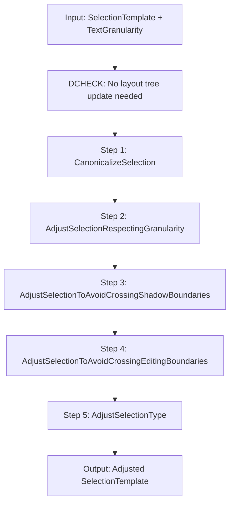
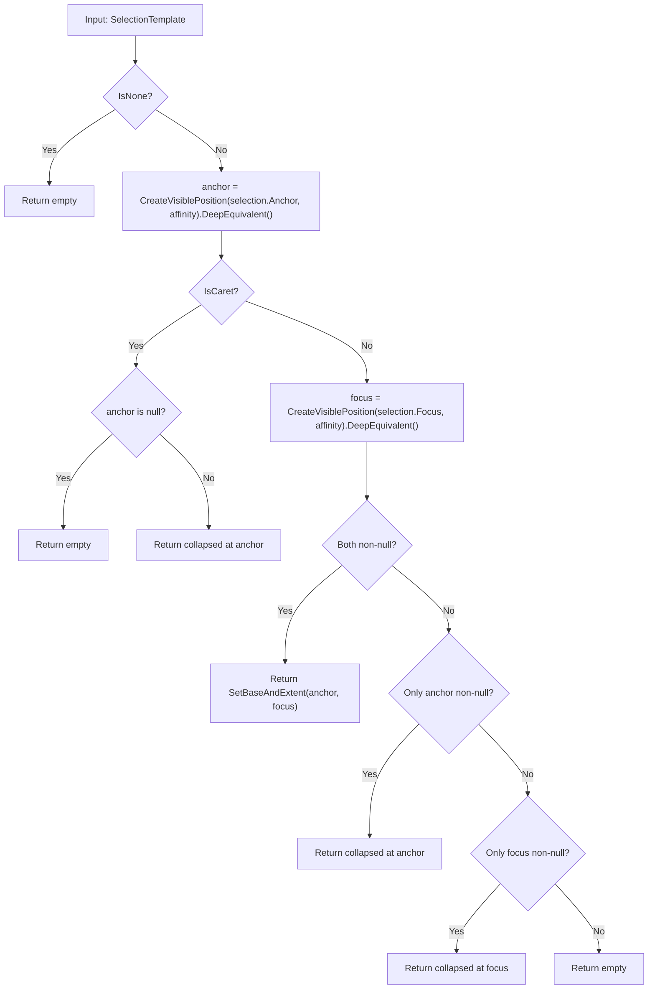
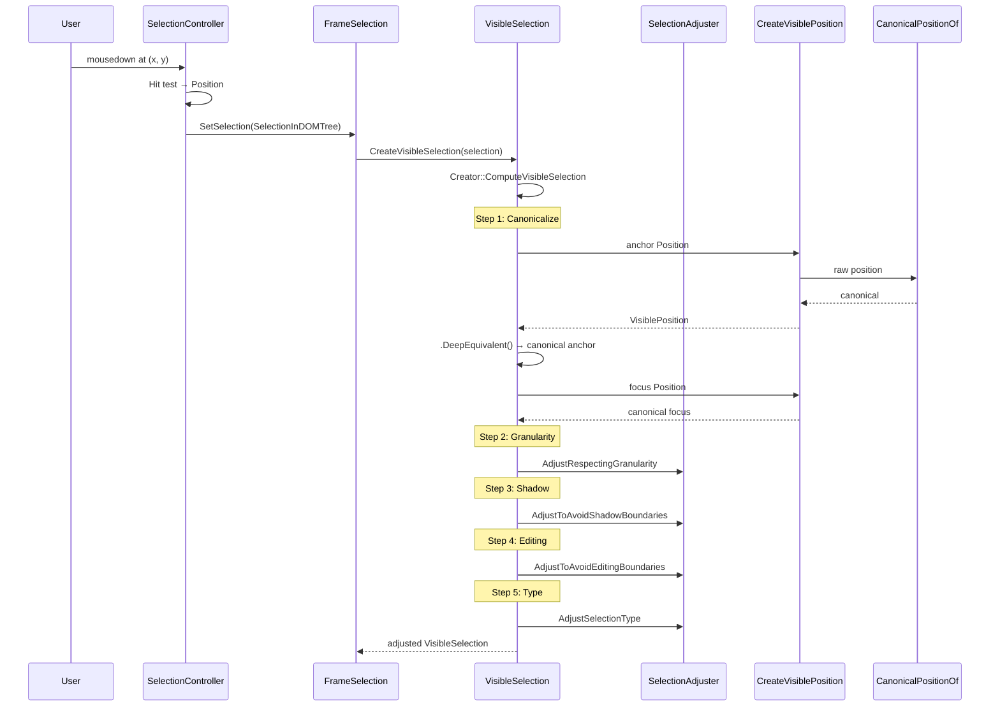

[← Chapter 3: Position & PositionTemplate Classes](03_position_and_position_template_classes.md) | [Home](README.md) | [Chapter 5: visible_* Files Reference →](05_visible_star_files_reference.md)

---

# Chapter 4: Selection and SelectionTemplate Classes

**Source files:**
- `third_party/blink/renderer/core/editing/selection_template.h`
- `third_party/blink/renderer/core/editing/selection_template.cc`
- `third_party/blink/renderer/core/editing/visible_selection.h`
- `third_party/blink/renderer/core/editing/visible_selection.cc`
- `third_party/blink/renderer/core/editing/selection_adjuster.h`

## 4.1 SelectionTemplate\<Strategy\>

A "virtually" immutable object representing a selection as two positions (anchor and focus) in the DOM or flat tree. Changes are made by creating a new selection via the `Builder` class.

### 4.1.1 Internal Storage

```cpp
PositionTemplate<Strategy> anchor_;       // Where the first click happened
PositionTemplate<Strategy> focus_;        // Where the end click happened  
TextAffinity affinity_ = TextAffinity::kDownstream;
mutable Direction direction_ = Direction::kForward;  // Cached
```

### 4.1.2 Direction Enum (Private)

| Value | Meaning |
|-------|---------|
| `kNotComputed` | Direction not yet determined |
| `kForward` | `anchor <= focus` |
| `kBackward` | `anchor > focus` |

Direction is computed lazily on first call to `IsAnchorFirst()`.

### 4.1.3 Key Methods

| Method | Return | Description |
|--------|--------|-------------|
| `Anchor()` | `const Position&` | The anchor position (first click). DCHECKs not orphan |
| `Focus()` | `const Position&` | The focus position (extent). DCHECKs not orphan |
| `Affinity()` | `TextAffinity` | The selection's affinity |
| `IsNone()` | `bool` | True if anchor is null (no selection) |
| `IsCaret()` | `bool` | True if anchor == focus (collapsed selection) |
| `IsRange()` | `bool` | True if anchor != focus |
| `IsAnchorFirst()` | `bool` | True if anchor <= focus (forward selection). Lazily computed |
| `ComputeStartPosition()` | `const Position&` | The earlier of anchor/focus |
| `ComputeEndPosition()` | `const Position&` | The later of anchor/focus |
| `ComputeRange()` | `EphemeralRange` | The range from start to end |
| `AssertValid()` | `bool` | DCHECKs DOM tree version matches, positions not orphan |
| `AssertValidFor(Document&)` | `bool` | Same + checks positions belong to document |

### 4.1.4 Builder Class

The `Builder` is a STACK_ALLOCATED helper for constructing `SelectionTemplate` objects. All mutations go through Builder.

| Method | Description |
|--------|-------------|
| `Builder()` | Empty builder |
| `Builder(const SelectionTemplate&)` | Builder from existing selection |
| `Build()` | Returns the constructed `SelectionTemplate` |
| `Collapse(Position)` | Set both anchor and focus to the same position (caret) |
| `Collapse(PositionWithAffinity)` | Same but also sets affinity |
| `Extend(Position)` | Set focus to a different position (range). Anchor must already be set |
| `SelectAllChildren(Node)` | Select all children of a node |
| `SetAsBackwardSelection(EphemeralRange)` | Set as backward (focus before anchor). Cannot be collapsed |
| `SetAsForwardSelection(EphemeralRange)` | Set as forward (anchor before focus) |
| `SetBaseAndExtent(EphemeralRange)` | Set base and extent from range |
| `SetBaseAndExtent(Position, Position)` | Set base (anchor) and extent (focus). Extent cannot be null if base isn't |
| `SetBaseAndExtentDeprecated(Position, Position)` | Allows non-null extent with null base (legacy). **TODO(yosin)**: should be removed |
| `SetAffinity(TextAffinity)` | Set the affinity |

### 4.1.5 InvalidSelectionResetter

A RAII guard that resets the selection if anchor/focus become disconnected or move to another document by the time the guard goes out of scope.

### 4.1.6 Type Aliases

| Alias | Strategy |
|-------|----------|
| `SelectionInDOMTree` | `SelectionTemplate<EditingStrategy>` |
| `SelectionInFlatTree` | `SelectionTemplate<EditingInFlatTreeStrategy>` |

### 4.1.7 Conversion Functions

```cpp
SelectionInDOMTree ConvertToSelectionInDOMTree(const SelectionInFlatTree&);
SelectionInFlatTree ConvertToSelectionInFlatTree(const SelectionInDOMTree&);
```

## 4.2 VisibleSelectionTemplate\<Strategy\>

A **visual** selection that has been adjusted/canonicalized for display. Created from a `SelectionTemplate` through a pipeline of adjustments.

### 4.2.1 Internal Storage

```cpp
PositionTemplate<Strategy> anchor_;    // Where the first click happened (adjusted)
PositionTemplate<Strategy> focus_;     // Where the end click happened (adjusted)
TextAffinity affinity_;                // Upstream/downstream affinity
bool anchor_is_first_ : 1;            // True if anchor is before focus
```

### 4.2.2 Key Methods

| Method | Return | Description |
|--------|--------|-------------|
| `Anchor()` | `Position` | The adjusted anchor |
| `Focus()` | `Position` | The adjusted focus |
| `Start()` | `Position` | The earlier of anchor/focus |
| `End()` | `Position` | The later of anchor/focus |
| `VisibleStart()` | `VisiblePosition` | Start as a VisiblePosition (DOWNSTREAM for range, current affinity for caret) |
| `VisibleEnd()` | `VisiblePosition` | End as a VisiblePosition (UPSTREAM for range, current affinity for caret) |
| `VisibleAnchor()` | `VisiblePosition` | Anchor as a VisiblePosition |
| `VisibleFocus()` | `VisiblePosition` | Focus as a VisiblePosition |
| `Affinity()` | `TextAffinity` | The selection's affinity |
| `IsNone()` | `bool` | No selection |
| `IsCaret()` | `bool` | Collapsed selection |
| `IsRange()` | `bool` | Non-collapsed selection |
| `IsAnchorFirst()` | `bool` | Whether anchor is before focus |
| `IsContentEditable()` | `bool` | Whether the start position is editable |
| `RootEditableElement()` | `Element*` | Root editable element of the start position |
| `ToNormalizedEphemeralRange()` | `EphemeralRange` | Normalized range (contracts around text, moves caret backward) |
| `AsSelection()` | `SelectionTemplate` | Convert back to a SelectionTemplate |

### 4.2.3 Affinity Rules for Visible Methods

| Method | Affinity Used |
|--------|--------------|
| `VisibleStart()` | `kDownstream` for range, current affinity for caret |
| `VisibleEnd()` | `kUpstream` for range, current affinity for caret |
| `VisibleAnchor()` | For range: `kUpstream` if anchor first, `kDownstream` otherwise |
| `VisibleFocus()` | For range: `kDownstream` if anchor first, `kUpstream` otherwise |

## 4.3 The VisibleSelection Creation Pipeline

The most important function: `Creator::ComputeVisibleSelection()`. This is the pipeline that transforms raw selection positions into visually valid, adjusted positions.



### Step 1: CanonicalizeSelection



**Key insight**: This step calls `CreateVisiblePosition()` on both anchor and focus, converting them to their canonical positions. This is where raw DOM positions become "visible" positions.

### Step 2: AdjustSelectionRespectingGranularity

Expands the selection to the appropriate granularity boundary:

| Granularity | Expansion |
|-------------|-----------|
| `kCharacter` | No change |
| `kWord` | Expand to word boundaries using `StartOfWordPosition()` / `EndOfWordPosition()` |
| `kSentence` | Expand to sentence boundaries |
| `kLine` | Expand to line boundaries |
| `kLineBoundary` | Expand to line boundaries |
| `kParagraph` | Expand to paragraph boundaries |
| `kDocumentBoundary` | Expand to whole document |

### Step 3: AdjustSelectionToAvoidCrossingShadowBoundaries

Prevents selection from spanning shadow DOM boundaries. If anchor and focus are in different tree scopes, adjusts the focus to stay within the anchor's tree scope.

### Step 4: AdjustSelectionToAvoidCrossingEditingBoundaries

Prevents selection from spanning editable/non-editable boundaries. Uses `HighestEditableRoot()` to determine editing regions.

### Step 5: AdjustSelectionType

Adjusts the selection type based on the final positions:
- If positions end up equal after adjustment → caret
- Otherwise → range
- Restores the original affinity

## 4.4 Helper Functions

### `CreateVisibleSelection(const SelectionInDOMTree&)` → `VisibleSelection`

```cpp
return VisibleSelection::Creator::CreateWithGranularity(
    selection, TextGranularity::kCharacter);
```

### `ExpandWithGranularity(SelectionInDOMTree, TextGranularity, WordInclusion)` → `SelectionInDOMTree`

Runs the full pipeline with a specified granularity. Used for word/sentence/paragraph selection.

### `NormalizeRange(SelectionInDOMTree)` → `EphemeralRange`

For carets: moves the range start upstream via `MostBackwardCaretPosition()`, then normalizes to parent-anchored form.

For ranges: normalizes the `EphemeralRange` directly.

```
// make style determinations based on the character before the caret
// or the first character of the selection
```

### `FirstEphemeralRangeOf(const VisibleSelection&)` → `EphemeralRange`

Simple conversion: uses `ParentAnchoredEquivalent()` on Start and End.

## 4.5 SelectionAdjuster — Static Methods

| Method | Description |
|--------|-------------|
| `AdjustSelectionRespectingGranularity` | Expands selection to granularity boundaries |
| `AdjustSelectionToAvoidCrossingShadowBoundaries` | Prevents shadow DOM boundary crossing |
| `AdjustSelectionToAvoidCrossingEditingBoundaries` | Prevents editing boundary crossing |
| `AdjustSelectionType` | Ensures selection type (caret/range) is consistent with positions |

### WordInclusion Enum

| Value | Description |
|-------|-------------|
| `kDefault` | If the selection touches a word boundary, include the word |
| `kMiddle` | Only include the word if the selection covers the middle of it |

## 4.6 Sequence: Creating a VisibleSelection from User Click



## 4.7 FIXMEs and TODOs

| Location | Text |
|----------|------|
| `Builder::SetBaseAndExtentDeprecated` | `TODO(yosin)`: Once all call sites are removed, remove this method |
| `ToNormalizedEphemeralRange` | `TODO(yosin)`: Most callers probably don't want this — using for historical reasons |
| `NormalizeRangeAlgorithm` | Relies on updated layout — "Failing to ensure this can result in equivalentXXXPosition calls returning incorrect results" |
| `EqualSelectionsAlgorithm` | Compares affinity, then anchor/focus |

## 4.8 Bug Links

| Bug | Context |
|-----|---------|
| [crbug.com/648949](https://crbug.com/648949) | Clients store VisiblePosition and inspect after mutation |
