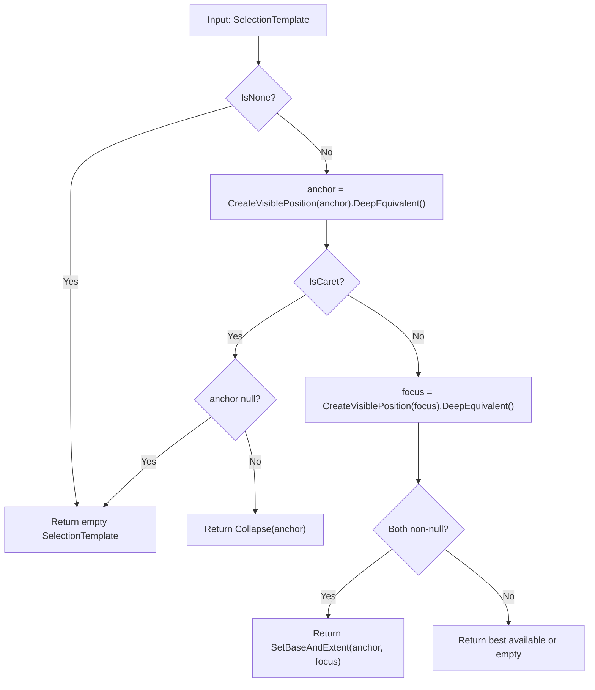
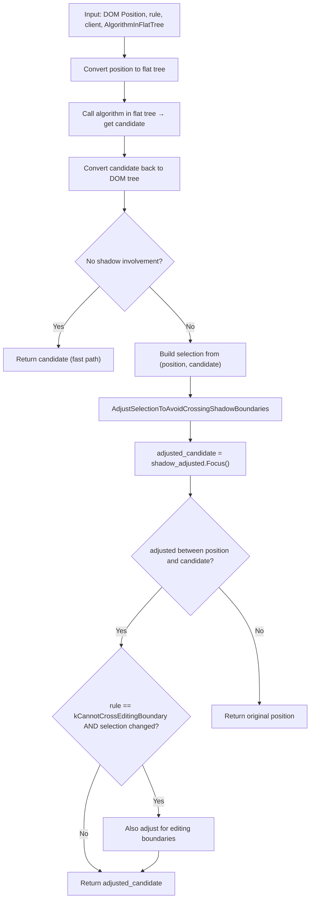

[← Chapter 4: Selection & SelectionTemplate Classes](04_selection_and_selection_template_classes.md) | [Home](README.md) | [Chapter 6: When VisiblePosition Is Triggered →](06_when_visible_position_is_triggered.md)

---

# Chapter 5: Files Starting with `visible_` — Complete Reference

**Source files covered:**
- `visible_position.h` / `visible_position.cc`
- `visible_selection.h` / `visible_selection.cc`
- `visible_units.h` / `visible_units.cc`
- `visible_units_line.cc`
- `visible_units_word.cc`
- `visible_units_sentence.cc`
- `visible_units_paragraph.cc`

## 5.1 visible_position.h / visible_position.cc

### 5.1.1 Class: `VisiblePositionTemplate<Strategy>`

Already covered in depth in Chapter 1 and 2. Key summary:

| Method | Return | Description |
|--------|--------|-------------|
| `Create(PositionWithAffinity)` | `VisiblePosition` | **The main factory** — canonicalizes position, resolves affinity |
| `DeepEquivalent()` | `Position` | The canonical position stored |
| `ToParentAnchoredPosition()` | `Position` | `DeepEquivalent().ParentAnchoredEquivalent()` |
| `ToPositionWithAffinity()` | `PositionWithAffinity` | The stored position + affinity |
| `Affinity()` | `TextAffinity` | UPSTREAM or DOWNSTREAM |
| `IsNull()` / `IsNotNull()` | `bool` | Null checks |
| `IsOrphan()` | `bool` | Disconnected from document |
| `IsValid()` | `bool` | DOM and style versions match (DCHECK-only) |
| `IsValidFor(Document&)` | `bool` | Valid for specific document |

#### Static Factory Methods

| Method | Return | Description |
|--------|--------|-------------|
| `AfterNode(Node)` | `VisiblePosition` | Position after a specific node |
| `BeforeNode(Node)` | `VisiblePosition` | Position before a specific node |
| `FirstPositionInNode(Node)` | `VisiblePosition` | First position inside a node |
| `LastPositionInNode(Node)` | `VisiblePosition` | Last position inside a node |
| `InParentAfterNode(Node)` | `VisiblePosition` | In parent, offset after the node |
| `InParentBeforeNode(Node)` | `VisiblePosition` | In parent, offset before the node |

#### Free Functions

| Function | Signature | Description |
|----------|-----------|-------------|
| `CreateVisiblePosition` | `(Position, TextAffinity) → VisiblePosition` | Main entry point |
| `CreateVisiblePosition` | `(PositionWithAffinity) → VisiblePosition` | From position+affinity |
| `CreateVisiblePosition` | `(PositionInFlatTree, TextAffinity) → VisiblePositionInFlatTree` | Flat tree variant |
| `CreateVisiblePosition` | `(PositionInFlatTreeWithAffinity) → VisiblePositionInFlatTree` | Flat tree variant |

## 5.2 visible_selection.h / visible_selection.cc

Covered in Chapter 4. Key additional details:

### 5.2.1 `CanonicalizeSelection()` — Private Static



This is where `CreateVisiblePosition()` is called for each endpoint, connecting the selection pipeline to the visible position computation.

## 5.3 visible_units.h / visible_units.cc — The Workhorse

This file group provides all the functions for navigating between visible positions at various granularities.

### 5.3.1 Position Navigation Functions

#### `CanonicalPositionOf`

| Signature | `Position CanonicalPositionOf(const Position&)` |
|-----------|------------------------------------------------|
| | `PositionInFlatTree CanonicalPositionOf(const PositionInFlatTree&)` |
| **Returns** | The canonical (leftmost valid) position among all visually equivalent positions |
| **Algorithm** | See Chapter 2, Section 2.3 |

#### `MostBackwardCaretPosition` (upstream)

| Signature | `Position MostBackwardCaretPosition(const Position&, EditingBoundaryCrossingRule, SnapToClient)` |
|-----------|------|
| **Returns** | The leftmost/upstream caret position that is visually equivalent |
| **Default rule** | `kCannotCrossEditingBoundary` |
| **Algorithm** | Iterates backward through DOM using `PositionIterator`, checks each position with `IsStreamer()`, skips invisible nodes, respects visual boundaries and editing boundaries |

#### `MostForwardCaretPosition` (downstream)

| Signature | `Position MostForwardCaretPosition(const Position&, EditingBoundaryCrossingRule, SnapToClient)` |
|-----------|------|
| **Returns** | The rightmost/downstream caret position that is visually equivalent |
| **Algorithm** | Mirror of `MostBackwardCaretPosition` but iterates forward |

#### `IsVisuallyEquivalentCandidate`

| Signature | `bool IsVisuallyEquivalentCandidate(const Position&)` |
|-----------|------|
| **Returns** | Whether the position is a valid caret position |
| **Algorithm** | See Chapter 2, Section 2.8 |

#### `EndsOfNodeAreVisuallyDistinctPositions`

| Signature | `bool EndsOfNodeAreVisuallyDistinctPositions(const Node*)` |
|-----------|------|
| **Returns** | Whether `[node, 0]` and `[node, last]` are distinct visible positions |
| **True for** | Non-inline elements, `<marquee>`, empty inline-blocks with CanHaveChildrenForEditing |
| **False for** | Inline tables, null nodes, no LayoutObject |

### 5.3.2 Next/Previous Position Functions

#### `NextPositionOf`

```cpp
VisiblePosition NextPositionOf(const Position&, EditingBoundaryCrossingRule);
VisiblePosition NextPositionOf(const VisiblePosition&, EditingBoundaryCrossingRule);
VisiblePositionInFlatTree NextPositionOf(const VisiblePositionInFlatTree&, EditingBoundaryCrossingRule);
```

**Algorithm**:
1. Find `NextVisuallyDistinctCandidate(position)`
2. Create a `VisiblePosition` from it
3. Apply boundary rule:
   - `kCanCrossEditingBoundary`: return as-is
   - `kCannotCrossEditingBoundary`: Adjust forward to avoid crossing editing boundaries
   - `kCanSkipOverEditingBoundary`: Skip to end of editing boundary

#### `PreviousPositionOf`

```cpp
VisiblePosition PreviousPositionOf(const VisiblePosition&, EditingBoundaryCrossingRule);
VisiblePositionInFlatTree PreviousPositionOf(const VisiblePositionInFlatTree&, EditingBoundaryCrossingRule);
```

**Algorithm**: Mirror of `NextPositionOf`.

Note: "going previous from an UPSTREAM position can never yield another UPSTREAM position (unless line wrap length is 0!)."

### 5.3.3 Character Functions

| Function | Signature | Description |
|----------|-----------|-------------|
| `CharacterAfter` | `UChar32 CharacterAfter(const VisiblePosition&)` | The character after the visible position. Uses `MostForwardCaretPosition()` to find the actual text node |
| `CharacterBefore` | `UChar32 CharacterBefore(const VisiblePosition&)` | `CharacterAfter(PreviousPositionOf(vp))` |

### 5.3.4 Document Boundary Functions

| Function | Signature | Description |
|----------|-----------|-------------|
| `StartOfDocument` | `Position StartOfDocument(const Position&)` | `FirstPositionInNode(*documentElement)` |
| `EndOfDocument` | `VisiblePosition EndOfDocument(const VisiblePosition&)` | `CreateVisiblePosition(LastPositionInNode(*documentElement))` |
| `IsStartOfDocument` | `bool IsStartOfDocument(const VisiblePosition&)` | `PreviousPositionOf(p)` is null |
| `IsEndOfDocument` | `bool IsEndOfDocument(const VisiblePosition&)` | `NextPositionOf(p)` is null |

### 5.3.5 Editable Content Functions

| Function | Signature | Description |
|----------|-----------|-------------|
| `StartOfEditableContent` | `PositionInFlatTree StartOfEditableContent(const PositionInFlatTree&)` | `FirstPositionInNode(*HighestEditableRoot(position))` |
| `EndOfEditableContent` | `PositionInFlatTree EndOfEditableContent(const PositionInFlatTree&)` | `LastPositionInNode(*HighestEditableRoot(position))` |
| `IsEndOfEditableOrNonEditableContent` | `bool IsEndOfEditableOrNonEditableContent(const VisiblePosition&)` | `NextPositionOf(position)` is null |

**TODO(yosin)**: `IsEndOfEditableOrNonEditableContent()` should be renamed to `isLastVisiblePositionOrEndOfInnerEditor()`.

### 5.3.6 Layout & Rendering Helper Functions

#### `HasRenderedNonAnonymousDescendantsWithHeight`

| Signature | `bool HasRenderedNonAnonymousDescendantsWithHeight(const LayoutObject*)` |
|-----------|------|
| **Returns** | Whether the element has non-anonymous descendants with non-zero height |
| **Special handling** | Returns false for display-locked elements. Empty content editable returns false. Skips anonymous elements |

**TODO**: "The semantics seems wrong when we're in a one-letter block with first-letter style, e.g., `<div>F</div>`"

#### `InRenderedText`

| Signature | `static bool InRenderedText(const Position&)` |
|-----------|------|
| **Returns** | Whether the position is within actually rendered (non-collapsed) text |
| **Checks** | Node is text, has layout object, contains caret offset, offset is at grapheme boundary |

**TODO(editing-dev)**: `PreviousNextGraphemeBoundaryOf()` work on DOM offsets but should use `offset_in_node` instead of `text_offset`.

#### `RendersInDifferentPosition`

| Signature | `bool RendersInDifferentPosition(const Position&, const Position&)` |
|-----------|------|
| **Returns** | Whether two positions render at different visual locations |
| **Method** | Compares `LocalCaretRectOfPosition` → `LocalToAbsoluteQuadOf` |

#### `PositionForContentsPointRespectingEditingBoundary`

| Signature | `PositionWithAffinity PositionForContentsPointRespectingEditingBoundary(const gfx::Point&, LocalFrame*)` |
|-----------|------|
| **Returns** | Hit-tested position at the given point, respecting editing boundaries |
| **Method** | Performs `HitTestRequest::kMove | kReadOnly | kActive | kIgnoreClipping`, then adjusts with `PositionRespectingEditingBoundary()` |

### 5.3.7 Editing Boundary Adjustment Functions

#### `AdjustBackwardPositionToAvoidCrossingEditingBoundaries`

| Signature | `PositionWithAffinity AdjustBackward...(const PositionWithAffinity& pos, const Position& anchor)` |
|-----------|------|
| **Logic** | If pos is outside the highest editable root of anchor → return empty. If same editable root → return as-is. If anchor is non-editable but pos is editable → return empty. Otherwise → `LastEditablePositionBeforePositionInRoot()` |

#### `AdjustForwardPositionToAvoidCrossingEditingBoundaries`

| Signature | `PositionWithAffinity AdjustForward...(const PositionWithAffinity& pos, const Position& anchor)` |
|-----------|------|
| **Logic** | Mirror of backward version. If pos is outside highest root → try last position in anchor's text node, else return empty. If anchor is non-editable → find last position in highest non-editable ancestor. Otherwise → `FirstEditablePositionAfterPositionInRoot()` |

### 5.3.8 Text Utility Functions

#### `SkipWhitespace`

| Signature | `Position SkipWhitespace(const Position&)` |
|-----------|------|
| **Returns** | The position after skipping whitespace characters (space, newline except '\n', no-break space) |

#### `CaretMinOffset` / `CaretMaxOffset`

| Function | Description |
|----------|-------------|
| `CaretMinOffset(const Node*)` | Minimum caret offset — uses `AssociatedLayoutObjectOf` |
| `CaretMaxOffset(const Node*)` | Maximum caret offset — delegates to `EditingStrategy::CaretMaxOffset` |

### 5.3.9 Rectangle/Bounds Functions

| Function | Signature | Description |
|----------|-----------|-------------|
| `ComputeTextBounds` | `Vector<QuadF> ComputeTextBounds(const EphemeralRange&)` | Get quads for text in range |
| `ComputeTextRect` | `gfx::Rect ComputeTextRect(const EphemeralRange&)` | Bounding rect of text in range |
| `ComputeTextRectF` | `gfx::RectF ComputeTextRectF(const EphemeralRange&)` | Float version |
| `FirstRectForRange` | `gfx::Rect FirstRectForRange(const EphemeralRange&)` | Rect of first line of range |

### 5.3.10 Internal Helper Functions

#### `IsStreamer`

```cpp
template <typename Strategy>
static bool IsStreamer(const PositionIteratorAlgorithm<Strategy>& pos) {
  if (!pos.GetNode()) return true;
  if (IsAtomicNode(pos.GetNode())) return true;
  return pos.AtStartOfNode();
}
```

A "streamer" position is one that is either in a text node, at an atomic node, or at the start of a non-atomic node. This filters out intermediate positions within element nodes where the caret shouldn't stop.

#### `EnclosingVisualBoundary`

```cpp
static Node* EnclosingVisualBoundary(Node* node) {
  while (node && !EndsOfNodeAreVisuallyDistinctPositions(node))
    node = Strategy::Parent(*node);
  return node;
}
```

Walks up ancestors until it finds a node whose start and end are visually distinct (block-level elements, etc.).

#### `InSameBlock`

```cpp
static bool InSameBlock(const Node* original_node, const Node* new_position_node)
```

Checks if two nodes are in the same block flow element. Used by `CanonicalPositionOf()` to prefer candidates in the same block.

Special handling for editable elements — checks DOM hierarchy.

#### `CanHaveCaretPosition`

```cpp
static bool CanHaveCaretPosition(const Node& node) {
  if (!node.IsSVGElement()) return true;
  if (IsA<SVGTextElement>(node)) return true;  // crbug.com/891908
  if (IsA<SVGForeignObjectElement>(node)) return true;  // crbug.com/1348816
  return false;
}
```

Returns false for most SVG elements (no caret in non-text SVG).

#### `AdjustPositionForBackwardIteration`

Adjusts `kAfterAnchor` positions for backward iteration:
- For `user-select: contain` nodes → converts to `ToOffsetInAnchor()`
- Otherwise → converts to `EditingPositionOf(node, CaretMaxOffset)`

#### `HasInvisibleFirstLetter`

Returns true if the node has a first-letter pseudo-element that is invisible.

#### `AtEditingBoundary`

Returns true if the position is at an editing boundary (between editable and non-editable content). A position is considered at editing boundary if:
1. It's the first position in node and next visually equivalent position is non-editable
2. It's the last position in node and previous visually equivalent position is non-editable
3. It's editable and both next and previous positions are non-editable

## 5.4 visible_units_line.cc

### Line Navigation Functions

| Function | Signature | Description |
|----------|-----------|-------------|
| `StartOfLine` | `VisiblePosition StartOfLine(const VisiblePosition&)` | Start of visual line |
| `StartOfLine` | `PositionWithAffinity StartOfLine(const PositionWithAffinity&)` | Position version |
| `EndOfLine` | `PositionWithAffinity EndOfLine(const PositionWithAffinity&)` | End of visual line |
| `InSameLine` | `bool InSameLine(const PositionWithAffinity&, const PositionWithAffinity&)` | Whether two positions are on the same visual line |
| `IsStartOfLine` | `bool IsStartOfLine(const VisiblePosition&)` | Whether position is at start of line |
| `IsEndOfLine` | `bool IsEndOfLine(const VisiblePosition&)` | Whether position is at end of line |
| `LogicalStartOfLine` | `VisiblePosition LogicalStartOfLine(const VisiblePosition&)` | Start of logical line (respects bidi) |
| `LogicalEndOfLine` | `VisiblePosition LogicalEndOfLine(const VisiblePosition&)` | End of logical line |
| `IsLogicalEndOfLine` | `bool IsLogicalEndOfLine(const VisiblePosition&)` | Is at logical end |

**TODO(yosin)**: Return values of VisiblePosition version of `startOfLine()` with shadow tree isn't defined well.

## 5.5 visible_units_word.cc

### Word Navigation Functions

| Function | Signature | Description |
|----------|-----------|-------------|
| `StartOfWordPosition` | `Position StartOfWordPosition(const Position&, WordSide)` | Start of word |
| `EndOfWordPosition` | `Position EndOfWordPosition(const Position&, WordSide)` | End of word |
| `MiddleOfWordPosition` | `Position MiddleOfWordPosition(const Position&, const Position&)` | Middle position between two word boundaries |
| `PreviousWordPosition` | `PositionWithAffinity PreviousWordPosition(const Position&)` | Previous word boundary |
| `NextWordPosition` | `PositionWithAffinity NextWordPosition(const Position&, PlatformWordBehavior)` | Next word boundary |
| `IsWordBreak` | `bool IsWordBreak(UChar)` | If character is a word break |
| `IsWordBoundary` | `bool IsWordBoundary(UChar)` | If character is a word boundary |

**WordSide enum**:
| Value | Description |
|-------|-------------|
| `kNextWordIfOnBoundary` | When on a boundary, report the next word's boundary |
| `kPreviousWordIfOnBoundary` | When on a boundary, report the previous word's boundary |

**PlatformWordBehavior enum**:
| Value | Description |
|-------|-------------|
| `kWordSkipSpaces` | Skip trailing spaces when moving by word |
| `kWordDontSkipSpaces` | Don't skip trailing spaces |

## 5.6 visible_units_sentence.cc

### Sentence Navigation Functions

| Function | Signature | Description |
|----------|-----------|-------------|
| `StartOfSentencePosition` | `Position StartOfSentencePosition(const Position&)` | Start of sentence |
| `EndOfSentence` | `PositionWithAffinity EndOfSentence(const Position&, SentenceTrailingSpaceBehavior)` | End of sentence |
| `EndOfSentence` | `VisiblePosition EndOfSentence(const VisiblePosition&, SentenceTrailingSpaceBehavior)` | VisiblePosition version |
| `PreviousSentencePosition` | `PositionInFlatTree PreviousSentencePosition(const PositionInFlatTree&)` | Previous sentence |
| `NextSentencePosition` | `PositionInFlatTree NextSentencePosition(const PositionInFlatTree&)` | Next sentence |
| `ExpandEndToSentenceBoundary` | `EphemeralRange ExpandEndToSentenceBoundary(const EphemeralRange&)` | Expand range to sentence end |
| `ExpandRangeToSentenceBoundary` | `EphemeralRange ExpandRangeToSentenceBoundary(const EphemeralRange&)` | Expand both ends to sentence |

**SentenceTrailingSpaceBehavior enum**:
| Value | Description |
|-------|-------------|
| `kIncludeSpace` | Include trailing whitespace in the sentence |
| `kOmitSpace` | Exclude trailing whitespace |

## 5.7 visible_units_paragraph.cc

### Paragraph Navigation Functions

| Function | Signature | Description |
|----------|-----------|-------------|
| `StartOfParagraph` | `VisiblePosition StartOfParagraph(const VisiblePosition&, EditingBoundaryCrossingRule)` | Start of paragraph |
| `StartOfParagraphInFlatTree` | `VisiblePosition StartOfParagraphInFlatTree(const VisiblePosition&, EditingBoundaryCrossingRule)` | Flat tree version for DOM-tree VisiblePosition |
| `EndOfParagraph` | `VisiblePosition EndOfParagraph(const VisiblePosition&, EditingBoundaryCrossingRule)` | End of paragraph |
| `EndOfParagraph` | `Position EndOfParagraph(const Position&, EditingBoundaryCrossingRule)` | Position version |
| `EndOfParagraphInFlatTree` | `VisiblePosition EndOfParagraphInFlatTree(const VisiblePosition&, EditingBoundaryCrossingRule)` | Flat tree version |
| `StartOfNextParagraph` | `VisiblePosition StartOfNextParagraph(const VisiblePosition&)` | Start of following paragraph |
| `IsStartOfParagraph` | `bool IsStartOfParagraph(const VisiblePosition&, EditingBoundaryCrossingRule)` | Is at start |
| `IsEndOfParagraph` | `bool IsEndOfParagraph(const VisiblePosition&, EditingBoundaryCrossingRule)` | Is at end |
| `InSameParagraph` | `bool InSameParagraph(const VisiblePosition&, const VisiblePosition&, EditingBoundaryCrossingRule)` | Same paragraph check |
| `ExpandToParagraphBoundary` | `EphemeralRange ExpandToParagraphBoundary(const EphemeralRange&)` | Expand range to paragraph |

Note: **"paragraph" is perhaps a misnomer** — paragraphs can be divided by line break elements (not just block elements).

**TODO(yosin)**: Return values of `startOfParagraph()` with VisiblePosition on flat tree isn't defined well.

## 5.8 MostBackwardOrForwardCaretPosition — Shadow DOM Handling



This wrapper function ensures that `MostBackwardCaretPosition` and `MostForwardCaretPosition` don't cross shadow DOM boundaries, using `SelectionAdjuster::AdjustSelectionToAvoidCrossingShadowBoundaries`.

## 5.9 SnapToClient Enum

| Value | Description |
|-------|-------------|
| `kOthers` | Default — standard caret position snapping |
| `kLocalCaretRect` | Used when computing local caret rectangles — detects editable boundaries between container and anchor nodes |

## 5.10 Bug References in visible_units files

| Bug | Location | Context |
|-----|----------|---------|
| [crbug.com/472258](https://crbug.com/472258) | `CanonicalPosition` | Expensive selection position updates |
| [crbug.com/891908](https://crbug.com/891908) | `CanHaveCaretPosition` | SVG `<text>` should support caret |
| [crbug.com/1348816](https://crbug.com/1348816) | `CanHaveCaretPosition` | SVG `<foreignObject>` should support caret |
| [crbug.com/1248744](https://crbug.com/1248744) | `MostBackwardCaretPosition` | Debug null adjusted_position |
| [issues.chromium.org/40890187](https://issues.chromium.org/40890187) | `CanonicalPosition` | Return position when it's a valid candidate but prev/next aren't in same editable root |

## 5.11 FIXMEs and TODOs in visible_units files

| Location | Text |
|----------|------|
| `CanonicalPosition` | `FIXME (9535)`: Canonicalizing to leftmost candidate causes caret painting issues at line wraps |
| `MostBackwardCaretPosition` | `FIXME`: PositionIterator should respect Before and After positions |
| `MostBackwardCaretPosition` | `TODO(yosin)`: Should work for positions other than kOffsetInAnchor |
| `HasRenderedNonAnonymousDescendantsWithHeight` | `TODO(editing-dev)`: Semantics wrong for one-letter block with first-letter style |
| `HasRenderedNonAnonymousDescendantsWithHeight` | `TODO(editing-dev)`: Avoid single-character parameter names |
| `IsVisuallyEquivalentCandidateAlgorithm` | `TODO(leviw)`: Condition should be `kBeforeAnchor` but supports legacy positions |
| `IsEndOfEditableOrNonEditableContent` (flat tree) | `TODO(yosin)`: Should rename to `isLastVisiblePositionOrEndOfInnerEditor()` |
