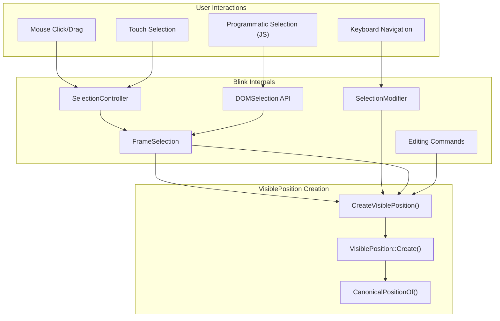
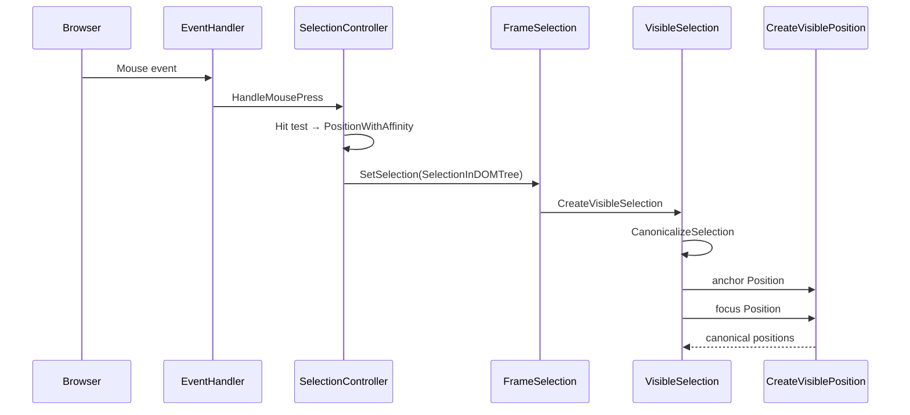
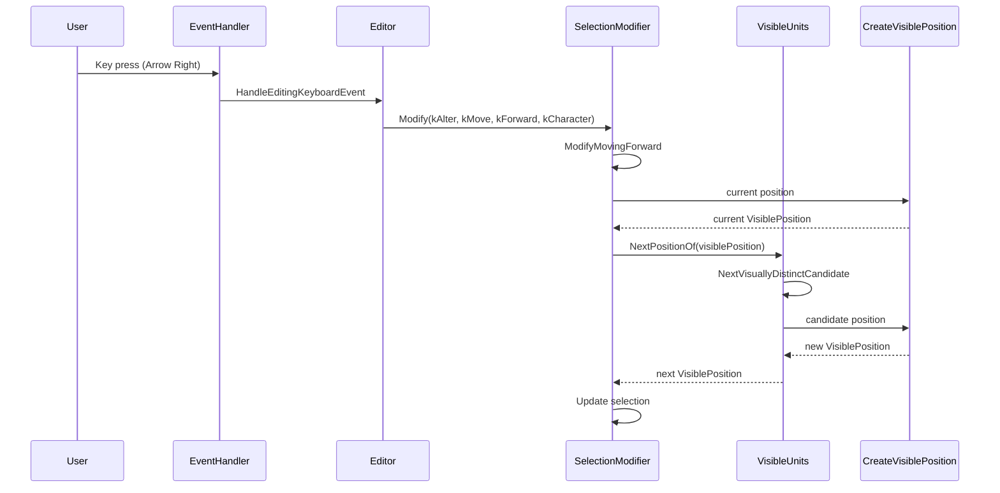
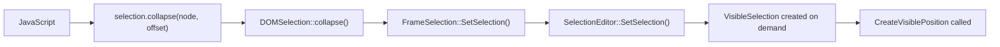
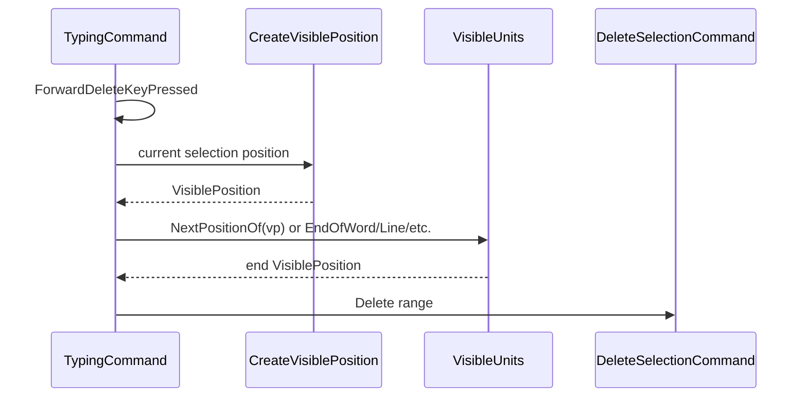

[← Chapter 5: visible_* Files Reference](05_visible_star_files_reference.md) | [Home](README.md) | [Appendix A: Function Reference →](07_appendix_function_reference.md)

---

# Chapter 6: When VisiblePosition Is Triggered — Usage & Callers

This chapter documents when and where `CreateVisiblePosition()` and `VisiblePositionTemplate::Create()` are invoked throughout the Blink editing codebase.

## 6.1 Primary Trigger Points



## 6.2 Mouse/Touch Selection

### SelectionController (`selection_controller.cc`)

When the user clicks or drags to select text:

1. **`HandleMousePressEventSingleClick()`**: Hit-tests the click position → gets a `PositionWithAffinity` → calls `CreateVisiblePosition()` to find the canonical caret position

2. **`HandleMouseDragUpdateSelection()`**: During drag, updates the selection extent → uses `CreateVisiblePosition()` for the new focus position

3. **`UpdateSelectionForMouseDrag()`**: Intermediate drag positions are canonicalized

4. **`HandleTripleClick()`**: Triple-click selects a paragraph → uses `StartOfParagraph()` and `EndOfParagraph()` which internally create VisiblePositions

### Trigger Chain



## 6.3 Keyboard Navigation

### SelectionModifier (`selection_modifier.cc`)

When the user presses arrow keys, Home, End, etc.:

| User Action | SelectionModifier Method | VisiblePosition Usage |
|-------------|--------------------------|----------------------|
| Left arrow | `ModifyMovingLeft()` | `PreviousPositionOf(VisiblePosition)` |
| Right arrow | `ModifyMovingRight()` | `NextPositionOf(VisiblePosition)` |
| Up arrow | `ModifyMovingBackward(kLine)` | Previous line position |
| Down arrow | `ModifyMovingForward(kLine)` | Next line position |
| Home | `ModifyMovingBackward(kLineBoundary)` | `StartOfLine(VisiblePosition)` |
| End | `ModifyMovingForward(kLineBoundary)` | `EndOfLine(VisiblePosition)` |
| Ctrl+Home | `ModifyMovingBackward(kDocumentBoundary)` | `StartOfDocument()` |
| Ctrl+End | `ModifyMovingForward(kDocumentBoundary)` | `EndOfDocument()` |
| Ctrl+Left | `ModifyMovingLeft(kWord)` | `PreviousWordPosition()` |
| Ctrl+Right | `ModifyMovingRight(kWord)` | `NextWordPosition()` |
| Shift+arrows | `ModifyExtending*()` | Same functions + selection builder |

### Flow for Arrow Key



## 6.4 JavaScript DOM Selection API

### DOMSelection (`dom_selection.cc`)

When JavaScript calls `window.getSelection()` methods:

| JS API | Triggers VisiblePosition? | How |
|--------|--------------------------|-----|
| `selection.collapse(node, offset)` | Yes | Through `FrameSelection::SetSelection` → `CreateVisibleSelection` |
| `selection.extend(node, offset)` | Yes | Same pipeline |
| `selection.selectAllChildren(node)` | Yes | Same pipeline |
| `selection.modify(alter, direction, granularity)` | Yes | Through `SelectionModifier` |
| `selection.setBaseAndExtent(...)` | Yes | Same pipeline |

### Range and Selection interactions



## 6.5 Editing Commands

### Common Commands That Trigger VisiblePosition

| Command | File | VisiblePosition Usage |
|---------|------|----------------------|
| `DeleteSelectionCommand` | `delete_selection_command.cc` | Compute delete boundaries, merge paragraphs |
| `InsertTextCommand` | `insert_text_command.cc` | Find insertion point, handle line breaks |
| `InsertParagraphSeparatorCommand` | `insert_paragraph_separator_command.cc` | Split paragraphs at visible position |
| `TypingCommand` | `typing_command.cc` | Forward/backward delete, insert text |
| `ApplyStyleCommand` | `apply_style_command.cc` | Find styled ranges using VisiblePosition |
| `IndentOutdentCommand` | Various | Paragraph boundary detection |
| `InsertListCommand` | `insert_list_command.cc` | List item boundaries |
| `MoveCommands` | `move_commands.cc` | All cursor movement uses VisiblePosition |

### Example: Delete Forward (Del key)



## 6.6 Spell Check & Input Method (IME)

### SpellChecker

Spell checking uses VisiblePosition to find word boundaries:
- `SpellChecker::GetSpellCheckMarkerUnderSelection()` — uses word position functions
- Range expansion to word/sentence boundaries

### Input Method

- `InputMethodController::SetComposition()` — creates VisiblePositions for composition range
- `InputMethodController::CommitText()` — uses VisiblePosition for insertion point

## 6.7 Accessibility

Accessibility tree generation uses VisiblePosition for:
- Text boundary computation (word, line, sentence, paragraph)
- Position conversion between accessible and DOM positions

## 6.8 Find-in-Page

`Editor::FindString()` and related functions use VisiblePosition to:
- Determine search range boundaries
- Canonicalize found range positions

## 6.9 Performance Considerations

VisiblePosition creation is **expensive** because it:
1. Requires a clean layout tree (may force layout)
2. Calls `CanonicalPositionOf()` which iterates through the DOM
3. Calls `MostBackwardCaretPosition()` / `MostForwardCaretPosition()` which are O(DOM size in the worst case)

From the source:
```
// Sometimes updating selection positions can be extremely expensive and
// occur frequently. Often calling preventDefault on mousedown events can
// avoid doing unnecessary text selection work. http://crbug.com/472258.
```

The `TRACE_EVENT0("input", "VisibleUnits::canonicalPosition")` trace event is specifically placed to track this cost.

## 6.10 When VisiblePosition Is NOT Triggered

VisiblePosition is **not** created for:
- Internal selection state storage (uses raw `SelectionInDOMTree`)
- Layout operations (uses raw positions)
- DOM mutation operations (uses raw positions)
- Range operations that don't need visual equivalence

The general rule: VisiblePosition is created when the **visual location** of a position matters — caret painting, selection display, editing command target computation, and user-facing position queries.
