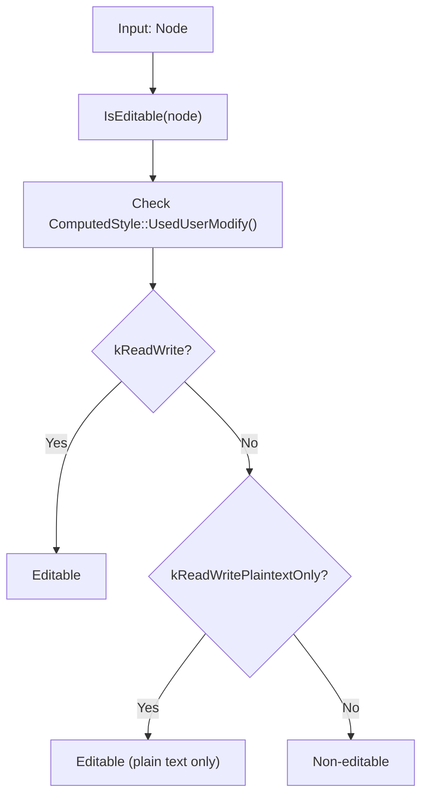
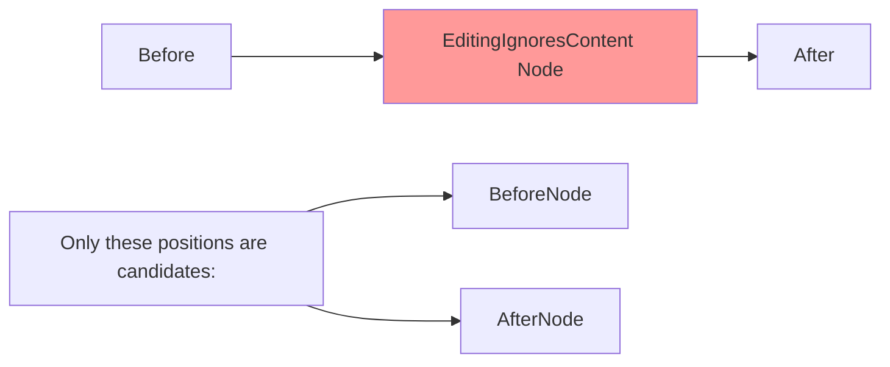
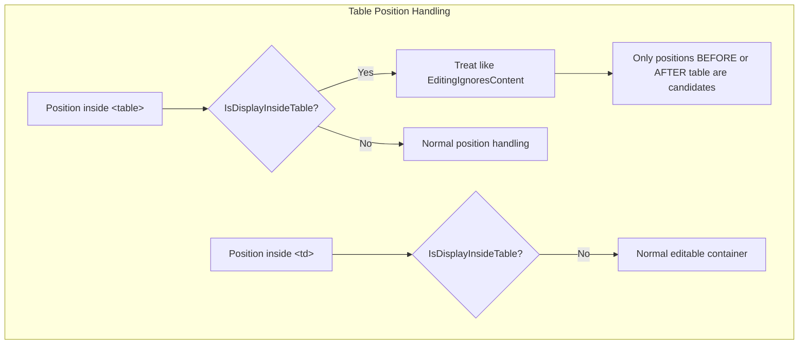

[← Appendix A: Function Reference](07_appendix_function_reference.md) | [Home](README.md)

---

# Chapter 7: Special Handling — Non-Editable Elements, Tables, Hidden Elements, Text, and SVG

This chapter details how the VisiblePosition computation pipeline handles specific element types differently.

## 7.1 Non-Editable Elements

### 7.1.1 How Non-Editable Elements Are Detected



### 7.1.2 Effect on CanonicalPositionOf

When searching for canonical positions, `CanonicalPositionOf()` ensures the result stays within the same **editable root**:

```
editing_root = RootEditableElementOf(position)
```

- If the next/previous candidate is in a different editable root → it's excluded
- If the position is in a non-editable `<html>` but `<body>` is editable → candidates from body are accepted
- If both `prev` and `next` are outside the editable root → return null (or position itself if the runtime flag `UsePositionIfIsVisuallyEquivalentCandidateEnabled` is on and the position itself is a valid candidate)

### 7.1.3 Effect on MostBackwardCaretPosition / MostForwardCaretPosition

During iteration:
- **Editability tracking**: Each time the iterator moves to a new node, editability is checked
- If editability changes (`start_editable != current_editable`):
  - `kCannotCrossEditingBoundary` + `kOthers`: **break immediately** (stop iteration)
  - `kCannotCrossEditingBoundary` + `kLocalCaretRect`: set `boundary_crossed = true`, continue iterating but handle boundary later
  - `kCanCrossEditingBoundary`: update `last_visible` and break (use boundary position)

When `boundary_crossed` is true and we're at a valid position:
- If same node as start → return original position (for Before/After anchor)
- Otherwise → return `AfterNode`(backward) or `BeforeNode`(forward) of current node

### 7.1.4 IsVisuallyEquivalentCandidate and Non-Editable

For **block-level editable elements** (LayoutBlockFlow/Flex/Grid):
- If element has rendered descendants with height → the position is only a candidate if it's editable AND at an editing boundary (`AtEditingBoundary`)
- If element is empty → position is a candidate only at the first editing position

For **non-block elements**: must be editable AND at editing boundary to be a candidate.

### 7.1.5 EditingIgnoresContent

Nodes where `EditingIgnoresContent()` returns true are treated as opaque:
- No VisiblePositions exist **inside** these nodes
- `MostBackwardCaretPosition`: returns `AfterNode` when at end of node
- `MostForwardCaretPosition`: returns `EditingPositionOf(node, 0)` when at start
- `IsVisuallyEquivalentCandidate`: only first and last editing positions are candidates



### 7.1.6 AdjustForEditingBoundary

```
Example:
<editable><non-editable>|abc</non-editable></editable>
=>
<editable>|<non-editable>abc</non-editable></editable>
```

If a position is inside a non-editable node, `AdjustForEditingBoundary()` tries `MostForwardCaretPosition` and `MostBackwardCaretPosition` (with `kCanCrossEditingBoundary`) to find an editable equivalent.

### 7.1.7 SkipNonEditableInAtomicMove

When the runtime flag `SkipNonEditableInAtomicMoveEnabled` is on, `NextVisuallyDistinctCandidate` / `PreviousVisuallyDistinctCandidate` can **skip over non-editable regions** entirely when using `kCanSkipOverEditingBoundary`.

## 7.2 Tables

### 7.2.1 IsDisplayInsideTable

```cpp
bool IsDisplayInsideTable(const Node* node) {
  return node && node->GetLayoutObject() && IsA<HTMLTableElement>(node);
}
```

Only `<table>` elements with layout objects return true.

### 7.2.2 Effect on Position Computation

Tables are treated specially like `EditingIgnoresContent` nodes:

#### In `ParentAnchoredEquivalent()`
```
FIXME: This should only be necessary for legacy positions, but is also
needed for positions before and after Tables
```

When a position's anchor is a table and offset is 0:
- Returns `InParentBeforeNode(table)` (position in parent, before the table)

When at the end of a table:
- Returns `InParentAfterNode(table)` (position in parent, after the table)

#### In `IsEditablePosition()` and `IsRichlyEditablePosition()`
If the container node is a table → **use the table's parent** for editability check. This prevents the table element itself from being the editing container.

#### In `RootEditableElementOf()`
If the container node is a table → adjust to use the table's parent before walking up.

#### In `MostBackwardCaretPosition()`
- Returns `AfterNode(*table)` when at end of table node

#### In `MostForwardCaretPosition()`
- Returns `EditingPositionOf(table, 0)` (effectively `BeforeNode`) when at start

#### In `IsVisuallyEquivalentCandidate()`
- Table nodes: only first and last editing positions are candidates
- Parent must be selectable

### 7.2.3 Table Parts

`IsTablePartElement()` returns true for: `<td>`, `<th>`, `<caption>`, `<col>`, `<colgroup>`, `<thead>`, `<tbody>`, `<tfoot>`, `<tr>`.

These elements are not treated the same as `<table>` — they are not checked by `IsDisplayInsideTable`. Table cells (`<td>`, `<th>`) are typically editable containers.



## 7.3 Hidden/Invisible Elements

### 7.3.1 Visibility Check in IsVisuallyEquivalentCandidate

```cpp
if (layout_object->Style()->Visibility() != EVisibility::kVisible)
    return false;
```

Positions in nodes with `visibility: hidden` are **never** valid candidates.

### 7.3.2 Display Lock (content-visibility: auto)

```cpp
if (DisplayLockUtilities::LockedAncestorPreventingPaint(*layout_object))
    return false;
```

Positions in nodes whose painting is prevented by a display lock are not candidates. This handles `content-visibility: auto` and similar features.

### 7.3.3 No LayoutObject = Invisible

Nodes with `display: none` have no `LayoutObject`:
```cpp
LayoutObject* layout_object = anchor_node->GetLayoutObject();
if (!layout_object)
    return false;  // Not a candidate
```

In `MostBackwardCaretPosition` / `MostForwardCaretPosition`:
```cpp
const LayoutObject* const layout_object = AssociatedLayoutObjectOf(...);
if (!layout_object ||
    layout_object->Style()->Visibility() != EVisibility::kVisible) {
    continue;  // Skip this position
}
```

### 7.3.4 HasRenderedNonAnonymousDescendantsWithHeight

This function determines if an element has visible content:
- Returns false for display-locked elements (conceptually no children)
- Returns false for empty content editables
- Iterates descendants looking for:
  - `LayoutText` with non-collapsed text
  - `LayoutBox` with non-zero logical height
  - Non-empty `LayoutInline` elements
- Skips anonymous and pseudo-element nodes

### 7.3.5 First-Letter Pseudo-Element

When a text node has a first-letter pseudo-element:
- If the first-letter fragment is invisible → `HasInvisibleFirstLetter()` returns true
- `MostForwardCaretPosition` handles this case specially — allows positions at start of remaining text even though they appear to be at start of node

## 7.4 Text Nodes

### 7.4.1 Rendered vs. Collapsed Text

`InRenderedText()` checks if a position is in **actually rendered** text:
1. Node must be a text node
2. Must have a `LayoutText` layout object
3. The caret offset must be contained (via `ContainsCaretOffset`)
4. Must be at a grapheme boundary (not inside a composed character)

### 7.4.2 Collapsible Whitespace

Text with `white-space: normal` (or similar) has collapsible whitespace. Multiple spaces collapse to one.

```
"foo     bar" → "foo bar" (visually)
```

Between "foo" and "bar", there are multiple DOM positions but only two **visible** positions (before and after the single rendered space).

`MostBackwardCaretPosition` and `MostForwardCaretPosition` use:
- `IsAfterNonCollapsedCharacter(offset)` — backward iteration
- `IsBeforeNonCollapsedCharacter(offset)` — forward iteration

These check `LayoutText::HasNonCollapsedText()` to skip fully collapsed text runs.

### 7.4.3 Grapheme Clusters

Position movement respects grapheme cluster boundaries:
- `PositionMoveType::kGraphemeCluster` — moves by grapheme (user-perceived character)
- Emoji sequences, combining characters, surrogate pairs are treated as single units
- Spec: [Unicode Standard Annex #29](http://www.unicode.org/reports/tr29/)

### 7.4.4 Text Start Offset

`LayoutText::TextStartOffset()` — the offset in the DOM text node where this layout text fragment starts. Important for split text (e.g., first-letter pseudo-element splits text into two layout objects).

## 7.5 SVG Elements

### 7.5.1 CanHaveCaretPosition

```cpp
static bool CanHaveCaretPosition(const Node& node) {
  if (!node.IsSVGElement()) return true;
  if (IsA<SVGTextElement>(node)) return true;   // crbug.com/891908
  if (IsA<SVGForeignObjectElement>(node)) return true;  // crbug.com/1348816
  return false;
}
```

Most SVG elements **cannot** have caret positions. Exceptions:
- `<text>` — can have text caret ([crbug.com/891908](https://crbug.com/891908))
- `<foreignObject>` — contains HTML content, so caret is needed ([crbug.com/1348816](https://crbug.com/1348816))

### 7.5.2 IsVisuallyEquivalentCandidate

```cpp
if (layout_object->IsSVG()) {
    // We don't consider SVG elements are contenteditable except for
    // associated |layoutObject| returns |isText()| true,
    // e.g. |LayoutSVGInlineText|.
    return false;
}
```

SVG elements are never candidates for visible positions, except when their layout object returns `IsText() == true` (e.g., `LayoutSVGInlineText`). This is checked before the SVG-specific block because text nodes are handled by the `layout_object->IsText()` branch.

## 7.6 BR Elements

### IsVisuallyEquivalentCandidate for BR

```cpp
if (layout_object->IsBR()) {
    if (position.IsAfterAnchor()) return false;
    if (position.ComputeEditingOffset()) return false;
    const Node* parent = Strategy::Parent(*anchor_node);
    return parent->GetLayoutObject() && parent->GetLayoutObject()->IsSelectable();
}
```

- Only the position **before** a `<br>` is a candidate, not after
- The editing offset must be 0
- The parent must have a selectable layout object

**TODO(leviw)**: The condition should be `anchor_type_ == PositionAnchorType::kBeforeAnchor`, but legacy positions need support.

## 7.7 Inline Elements

### Empty Inline Elements

`IsEmptyInline()` — checks if a `LayoutInline` has no visible content:
- Skips floating/out-of-flow children
- Recursively checks inline children
- Skips all-collapsible-whitespace text children

Used in `HasRenderedNonAnonymousDescendantsWithHeight` to detect empty inline-blocks that still have visible line box bounds.

### EndsOfNodeAreVisuallyDistinctPositions for Inlines

```cpp
if (!layout_object->IsInline()) return true;  // Non-inline → always distinct
if (IsA<HTMLTableElement>(*node)) return false;  // Inline table → not distinct
if (IsA<HTMLMarqueeElement>(*node)) return true;  // Moving → always distinct
return layout_object->IsAtomicInline() &&
       CanHaveChildrenForEditing(node) &&
       !To<LayoutBox>(layout_object)->StitchedSize().IsEmpty() &&
       !HasRenderedNonAnonymousDescendantsWithHeight(layout_object);
```

An inline element has visually distinct ends only if it's:
- An atomic inline (replaced element or inline-block)
- Can have children for editing
- Has non-zero stitched size
- Does NOT have rendered descendants with height (i.e., it's empty)

## 7.8 Writing Mode Boundaries

`MostBackwardCaretPosition` and `MostForwardCaretPosition` stop when the writing mode changes:

```cpp
if (!writing_mode.has_value()) {
    writing_mode.emplace(layout_object->Style()->GetWritingMode());
} else if (*writing_mode != layout_object->Style()->GetWritingMode()) {
    return last_visible.ComputePosition();
}
```

This prevents the caret from moving across vertical/horizontal writing mode boundaries within the same visual boundary.
